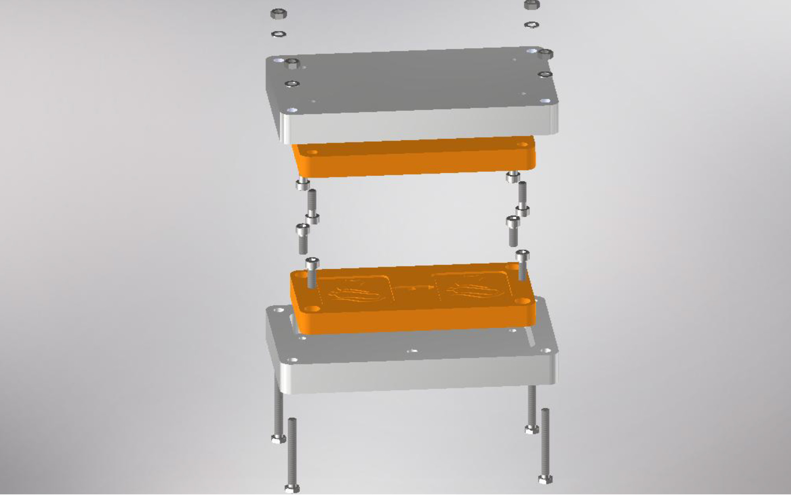
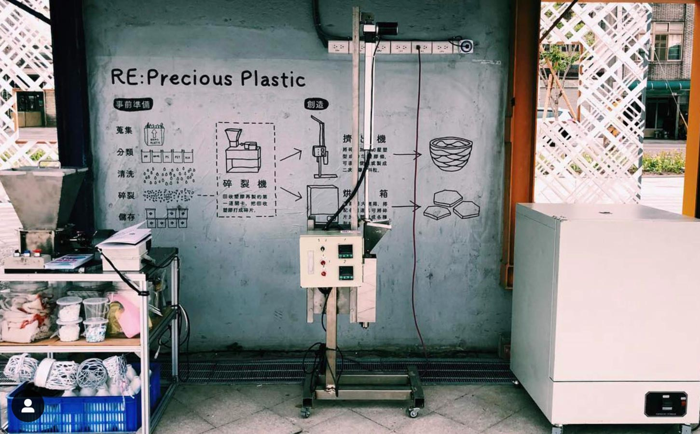

# Plastic CUP – Injection Molding Optimization

## Project Status

Ongoing project focused on improving recycled plastic injection molding through mold design optimization and parameter tuning.

### 3D Printed Mold

### Injection Molding System

## Overview
This project focuses on improving a recycled plastic injection molding system used by the **Plastic CUP** recycling initiative.

The system uses a **3D-printed mold** to enable low-cost tooling and rapid prototyping for recycled plastic products.

## Objectives
- Improve part quality
- Reduce molding defects
- Optimize injection molding parameters
- Evaluate performance of 3D-printed molds

## Engineering Work
- Analysis of injection molding cycle
- Optimization of holding pressure and cycle timing
- Mold design evaluation
- Iteration of **3D-printed mold geometry**
- Process improvements for recycled polymer manufacturing

## Tools
- CAD (Inventor / SolidWorks)
- Injection molding machine
- 3D printing (FDM)
- Manufacturing process analysis

## Project Context
This work is part of a collaboration with **Plastic CUP**, a recycling initiative focused on sustainable plastic reuse and community manufacturing solutions.

## Future Work
- Further mold geometry optimization
- Cycle time reduction
- Material flow analysis
- Improved mold durability
  ## Project Images

